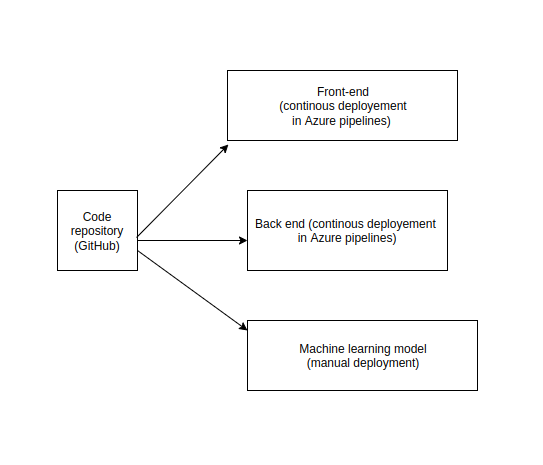
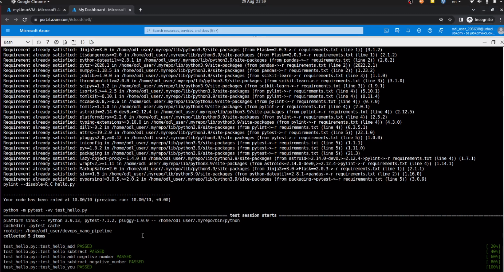
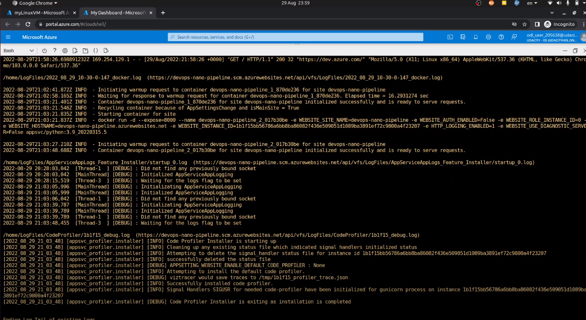

# Overview

The second project of DevOps Udacity Nanodegree was focused on building CI/CD pipelines in a machine learning project. The goal was to run Flask machine learning web applications in the Azure Cloud and automatically integrate and deploy changes.

## Status

[](https://github.com/lengyellukas/devops_nano_pipeline/actions/workflows/pythonapp.yml)

## Project Plan
The project plan expects to deliver the machine learning application in one year. So, from a basic idea until the go-live, it should take approximately one year including the training the prediction model, analysing its results and implementing front-end and back-end.

* The week-by-week plan can be found in the online spreadsheet: [Project Plan spreadsheet](https://docs.google.com/spreadsheets/d/1NQyCdQkhMzS_OXzM_0zBACwfOxT06Md75_RDT5klGmc/edit#gid=1348135932])
* Trello board for the project with main tasks: [Trello board](https://trello.com/b/14yYiJMS/project-tasks)

## Instructions

* Architectural Diagram



* To run and try the machine learning application, you should have access to Azure Portal and Azure DevOps.


* You need to create a project in Azure DevOps and link it with this GitHub repository


* You can deploy the application in Azure Portal using Azure Shell. Simply clone this GitHub repository and run Makefile to install needed dependencies:
```bash
make all
```
 Part of steps in Makefile is to run the tests. In this case, all the tests were successful.




* You can deploy the application using command: 
```bash
az webapp up --name <application name> --resource-group <resource group name> --runtime "PYTHON:3.7"
```
After successful deployment, you will receive back URL and you will be able to access the application.


* From Azure Cloud Shell, you can also try the machine learning model to get a price prediction. You just need to change URL of the application in the shell script.
```bash
./make_predict_azure_app.sh 
```


* After any change to the repository, the changes will be automatically deployed using Azure Pipelines. You can check the result of deployment in Azure DevOps.


* If you prefer the option to only integrate the changes into the repository without continous deployment, you can use existing GitHub actions, to only run the tests.


* As the application is running in the Azure Cloud, it is possible to access the logs using Azure Cloud Shell with command:
```bash
az webapp log tail
```




> 

## Enhancements

* The tests are not sufficient to decrease the risks of defects.
* No performance tests were planned or executed. In case of spike of users, the application might face performance issue.

## Demo 

The demo of the application and CI/CD pipeline is available on YouTube. [Link to the video](https://www.youtube.com/watch?v=SDHQR49Kbaw)


